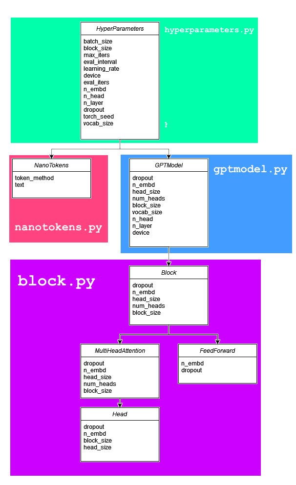
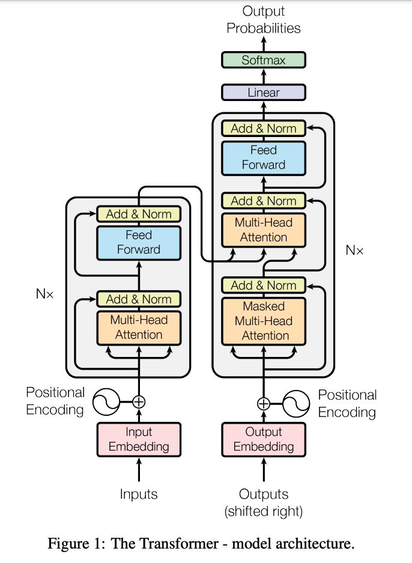

# NanoGPTExperiment
### What is this project about?
This project was my attempt at building a gpt model - similar to Chat GPT.
The primary goal when I started this in the summer of 2023 was to build the model piece by piece to gain an understanding of transformers, train it on a small dataset, and then try to generate meaningful output.
Since picking the project back up again with the start of my NLP studies, I aim to expand on my original code, introducing different tokenisation and generation methods.
### Current goals:
- [x] Implement N-character tokenisation
- [ ] Implement N-gram tokenisation
- [ ] Implement different generation methods
- [ ] Create save/load functions for GPTModel

## Setup
Windows:
```
py -m venv venv
venv\Scripts\activate.bat
py -m pip install --upgrade pip
python3 -m pip install torch --index-url https://download.pytorch.org/whl/cu117
py -m pip install -r requirements.txt
```

Linux/OSX:
```
python3 -m venv venv
venv/bin/activate
python3 -m pip install --upgrade pip
python3 -m pip install torch --index-url https://download.pytorch.org/whl/cu117
python3 -m pip install -r requirements.txt
```

## Running the Model
To run this model, you need to have a CUDA supporting GPU, otherwise it will take a long time to run on a CPU.
The model takes in an input text file, the longer the better, and tries to generate text based off of the character sequences found in the text.

I've supplied 2 example texts to the model, one is the entire works of Shakespeare (1,115,394 characters) and episodes IV to VI of Star Wars (159,478 characters).

You can change the file directory on line 11 of main.py, and in the `/src/` directory run either:
`py main.py` or `python3 main.py`

## Findings
I first developed the model with N-character tokenisation. At first glance the N-character tokenisation see
### 1-Character
The first results I generated was with a 1-character model. At first glance the 1-character model appears to be a normal Shakespeare script, with appropriate new lines and paragraphs, but under close inspection it makes no grammatical sense.
It can predict and generate new characters given the previous characters of a sentence, but it does not understand the words in a contextual sense - because the model does employ word or sentence embeddings. Despite this, it is very good at constructing actual words, just not very good at stringing them together in a way that makes grammatical or semantic sense.

### 2-Character
The second results I generated was with a 2-character model. We see similar patterns and results to the 1-character model, with the 2-character model also not making grammatical or semantic sense. However, we consistently get better strings of words.

### 3-Character
The 3-character model seems to get considerably better results then the 1 and 2 character models.

### Dataset comparison
It's interesting to compare the output of both the Shakespeare text and the Star Wars text.
The Shakespeare text is more unique and random than the Star Wars text, but is less coherent.
When I was training on the Star Wars  text, I found that the model got a significantly lower training loss but the validation loss started to climb up as it neared 5000 steps. I think this is because it started to overfit the text data, as the script is too too small. Despite this there are more lines in the generated Star Wars text that make sense, like "*LEIA: Are you all right?  Come on.*". However, I feel this is because these kinds of phrases would appear multiple times throughout the script.
There is potentially much to do here with word/sentence embeddings, which would allow the model to generate more coherent sentences - though I want to start over with a new model to do this.

<br>

## Results
#### 1-Character
<details>
    <summary>1-Character Shakespeare</summary>

    AUFIDIUS:
    So warrant, Sir, uncle;
    Do here one gentle fet her father proceed
    Faith strike and the cale in all her man!
    A children, and like me soundly convey'd worship;
    But who should pity your royaling gentleman?
    He liest me w friends ne're not of you are nor greet of
    ot, you fire. In us nothing truth to be done.

    MENENIUS:
    The besteed, he'll ever she died me better with her.

    PERDIVERSO:
    To she.

    Second Servingman:
    So here, but puts you with witding, flower 'tis told:
    The fathere shall provoke her beggarle,
    But see apolume you to rusing in herself.

    JOHN OF GAUNT:
    That they shall enrich with King Herence's darth,
    Or oft orath! Look and they that thou wantor bends,
    Thou so left'st thou hast to loath, pale to mark our:
    Whast any mind, booth will he soot it beloved,
    To fe my forfe; and I have done,--

    LADY ANNE:
    So standing what?

    ROMEO:
    Should it.

    KING LEWIS XI:
    Hold, hark: shall come the kneft duke off;
    He weight make daughter courself and part indeed:
    But she would strift
    Intercale mercy, if the will cannot shall sit

    Put ever: there is that third in the tales of men
    Amagia wall hence, on the his body of men,
    To prepared in him.

    GREGORY:
    Speak madly great in this desperate corse;
    Indeed from that he list to stay, so live,
    Let that yet no excuse, go my mind. Have I
    An imper thy Forbalty weath to him honour.

    KING HENRY OVI:
    Go, be make far, many lord.

</details>

<details>
    <summary>1-Character Star Wars</summary>

    LEIA: You like back it!

    LANDO: Backing them? Whey don't -- wrong, we come here?

    LEIA: All right? I'm quite powerfr to compass.

    HAN: Command you too late vacuate.

    HAN: Not really!

    LUKE: Dack!

    HAN: You havo one board scons.

    LEIA: You would use, going?

    THREEPIO: Do you take this true point! The ability to this shat!  Some kid!

    THREEPIO: Look!  I told you to forget it.  Turn to outrange, which will you be.

    HAN: Then they hear st. I lose to your deaction!

    LUKE: I told my gone in in the fire quire.

    LUKE: I'll be just going crazy with you, the Jabba the Hutt.

    LI'm trying compled!

    HAN: Chewie! G--one-three!

    HAN: Get out there!

    LEIA: Are you all right?  Come on.

    LUKE: I'll be at two!

    HAN: Get of her!

    LUKE: Now!  Come on!

    LEIA: I you gotta good with about you.  Oucce make stop!  Where could plensure?

    LUKE: You, but this fightere wars aways!

    LUKE: Look I'm a way another you could. Thear-- you get? Oh, did up! Oh! So go!

    THREEPIO: Sir, that of your shipful! Jabba at madme well palt!

    HAN: Chewie, get up on the security-tworders and not aventher energy season.  We'll move on the leader shield and cannon will give confire those planetration block AA--ythreport ling.  The Rebel cruise well speed from a great pilot of being strange.

    LUKE: It looks like I'm going nowhere.

    HAN: I'm all right, patrol. Now for a droids will if I get bocEdeult. Right speed, signal.

    LEIA: Cut the ship no leave!

    HAN: Ult me to it!

    LUKE: Jabba.  He's that only a fighter place chance.  You have been jettisoned.

    VADER: Did you fire droids?

    LANDO: No, we've going aboard. I just want you to live been patience.

    YODA: Hman change. No disince time.

    HAN: I could about somebody get this big so bucket I could.

    LUKE: Thank you. To younders.

    THREEPIO: I once you \Nice!  Come on!

    HAN: I told you to turn one.

    HAN: Don't to really to picked out by hom interfere.

    LUKE: What about the might helpere?  You know it!

    LUKE: Quietly, see where might back.

    THREEPIO: Jabba offers the but of your sight, sir.  I interructed and in a

</details>

#### 2-Character

<details>
    <summary>2-Character Shakespeare</summary>

    ABETH:
    A bait will leader for most summer law. I'll to discove them.

    First Caius from the want.

    WhicERLady:
    Go, hence.

    CAPULET:
    O dead!

    AUFIDIUS:
    So sir audierate is go better compouts and more.

    SICINIUS:
    Condition against, go all:
    Sinker you'll stay out of Rome.

    CORIOLANUS:
    Nearer sense are trust them!

    First Citizen:
    Ay, series; it goes win
    Here could have beheld him a worthy for his spilt
    In law, no lesser wife will voay.
    And, what you will dead?

    SAMPSON:
    But shepherd! same ut I, sir; and who, office thou commonst!

    JOHN OF GAUNT:
    Sir, that let me stand before her again!

    NORTHUMBERLAND:
    For being drunk them, thy lord;
    Forbot on the thousand duty dug and my dealth.

    GLOUCESTER:
    Even that my traitor woes
    That bleedy patritten scourge the idle bonds
    Of move and bid thyself, and forced thee,
    Setake thy leagues to expediention of such
    And to win the wind to tedious wounds with thy gentlewo art
    the two gorge home: to Content;
    For evident themselves
    Beseen until that ever power-but I say well. well, Is
    doubt, Ill, fetch against thy father, well patient of York:
    If write, if we come then? or your eye-hook
    Shall perist not for Time.

    TYRREL:
    Thus knee not for doubt such war:
    'Tis not much go to excell him about his country.

    KING RICHARD II:
    Even so he that thou pity in thy soldiers!

    DUKE OF AUFIoiew my son:
    Why is the oract that a heart is us stay:
    Which shall my beautiful tongue that refuse
    For our virtueds tunety takes me to be
    some witness; to one badees? but, if we hate our eye.

    LADY CAPULET:
    My liege!

    ROMEO:
    What?

    Messenger:
    Be very pimbly, indeed. You are opposed
    not an untauntimed cred to shore them on other.
    TuRTHUMBERLAND:
    The purse take your grace of me
    To wave at one to bear us us of lawful lett
    That we are weak usurp?

    Second Musician:
    They'll't not weep; but let them be king;
    for, since notwice know him man let:
    I'll make take my gentle angry tilted
    Young landed enemies, your tongue present;
    Hear him to attaste where I speak.

    PAULINA:
    I came to some much that
    As by your first harm cannot do this particules am
    Your band-countaintion this envious shall and
    Forth for having night. Coventry, kill him: stay,
    I'll unget him for God live him am oppoor to
    stnaty to this crown helmed-trees, be marr'd; 'God!
    Rine adiers, corse practise voices, girl,
    My life, sometime to part
    Because their colour.

    EXETER:
    Have not the king of peace?

    Too rashful:
    I hope to supply gift can constable,
    That I vow for himself thy mind:
    And therefore, marry, that alone; cannot yield it!

    ROMEO:
    So royal friends of my tent.
    Heaven, phen ospesy!

    GREMIO:
    Besides my back! madam, and between nosor
    but beavens some days: I'ld try you
    So too grief as they, as my ladies to him?

    CLARENCE:
    Under grief; I pray you, grand Buckingham a
    grief strike beats for his great ley and eye.

    KING HENRY VI:
    Why, to choose the tentastivious weddle angrey
    That you repeal wish the purseman of stoccasion;
    No twes; not from no more messetable.

    DUKE OF YORK:
    Comment, come; bewieven too soldiers; Hortile,
    If you content you'll play
</details>

<details>
    <summary>2-Character Star Wars</summary>

    AA, makes up!
    NEEDA: Only movery ybody.  Do you know him?
    CREATURE: Help you. You would be done. For my ally the sattle side of fact!  My hand no sign of th My father religion. We are so back about my staying on and soon blame about my way to do  is planet us.
    LUKE: Like!  if they're been up!  Okay!
    THREEPIO: We're watch your!
    HAN: We're watch your back, going into the city!
    LUKE: Listen, friend, that's what you'll be IA: fortunation  are working if it can't him beginning to take him back. We going to fry iends with the Falcon, kid.
    LUKE: But what that is do you.  No, I want to check it out on along by all myselfunction.  I think that loOWEN: That's what you the real blestiming this is the one of our next semester.  If you'll hu   unable to see the message to your master soon on the deal.  We'll do to stay here much function!
    LUKE: Artoo.  Dagoings This place is the in zone out of the choice.  He might bet us.
    LUKE: All right, I'd like to take him down to maintenance power.  No!
    BIGGS: This is it.  Rouge Three you are clouds coming in.
    LUKE: Hey.
    BIGGS: Come in with nce well.  I cut you off for a few time -one, for you.
    LUKE: Nothing.  I'm all right.
    LUKE: There's all right.  Bring Look your father and I wish I was going..
    LUKE: But I was going to Toshi Station to pick up some power.  No signal... not any  fry of anircentures.  There's not my plic ere are work.
    LUKE: I'm sorry to saved my mindred him.  That is the way of things ... the way of the Force is if you?
    LUKE: Well, I don't want the Emperor'.  Hang on our tight now.
    VADER: Imperial ways been sh have your felt it was until on.
    HAN: That looks pretty good.  You have the magnetic field by the far to the Rebellion.   All right, I've lost my guts wither Dantooine to your abrce  I become back.
    LUKE: My scope can't see a thing time. She's going to be wrong ong the  spice of the spice miness.
    LUKE: We're on our on our only chance.  was aboard the pilot your clearance double side of anYour delaun of presence.
    LANDO: What are you doing here?
    LUKE: I know, I know what she mean e very good pilot you.  You can do about the next year?
    BIGGS: You can subs  on the place the effort.  Come over the hyperdrive.
    THREEPIO: There's something our chance!  Go!
    r in there an hands are no set the corrKAy stupt.  We'll never out of the ship that deactivate has been deily!
    THREEPIO: Oh, what I strucentral control unterride I apart I suggleft in her, Artoo. I be more careful.
    LUKE: Oh, my.
    ! Oh, no!
    THREEPIO: Oh, no.  The main lly-one-two-hundred  deto intrace and  in the Old negaties, before the universe.  I have ferect missed you for a choice?
    GREEDO: Not yet.  If you got some thing to else.
    HAN: Look at me! You want my like I'll pay you back the scanner. Plar back the city cling.
    BIGGS: Luke!  Remembered!
    TRENCH OFFICER: We are seven an emy ships out of the  magnetic field.
    RED LEADER: Hold tight up around for your signal.... to stand  friend.
    LUKE: Dantooine Vader!
    LU
</details>

#### 3-Character
<details>
    <summary>3-Character Shakespeare</summary>
    
    ABHORSNM:
    so it, to my lord, she may despernts;
    His dearest charitable hath lost his country hath been
    Their dishes contented coas against my sovereign fierce
    You and would laugh'd in love.

    LEONTES:
    No, but he, in this fellow like all: you
    Shall have at a give.

    HERMIONE:
    Yes! Camillo, speak to it?

    LEONTES:

    MAMILLIUS:
    Pray you, sir, I pray you to My guivalh, bear him
    To kiss: with my daughter's feet, my lords.

    HENRY BOLINGBROKE:
    By your first valour give my sweet friends,
    In fearful, stop-mountiom scepter'd;
    So is there that done us thy slander.

    MERCUTIO:
    Peace, use it. Young amain.

    ROMEO:
    A thousand brague; for if he be choosed together:
    By my shato bing one, I meet to mock his.

    BRUTUS:
    And he shall in mortal adversam mutounch.
    Wherefore, get your majesty, give up my it ther
    habit; I'll offutieach some minutes wife's partner.

    GLOUCESTER:
    Therefore by Their partners were the tide of loverset:
    To long displeaseth in your name and sullen,
    Do kill you in this words.

    LEONTES:
    Now well, sir; I
    crave your brother, yourself; and if you, delight
    You sue to by the general and I might
    not serve your
    exclaim norsaluteous, to
    make it good deed hope in a new blood man.

    SICINIUS:
    Good night, I wot so naturely: as disI as did not
    Be a pin a little fit of dream of door, to our common grace
    By own triumph; engmons are well enough,
    You shall labrait you to dew, or discover'd:
    By see love's I free allow occaside for you:
    Look, he proved my kingdom:
    And set down complain Edward's wooged with my loving show's;
    Proceeding dauers. And how are I to Too many place?
    Thine earth he hath posgry eyes, might hell'd you have prevail'd.

    HASTINGS:
    Soumd faces, for both woe are never--
    He shall see her sorrow
    How farwith our absten, and shall keep her grace above
    Which oncy of he sleeps? By you all.

    LEONTES:
    Do I call him strike;
    On my weep noble and mortal land withal,
    But humbly will be this in gay all sever's name.
    See, share up to me now, from this milkmaury!

    AEdile:
    My master stir sword
    In trial-back arms,
    Whose levy occasing mounting happy for this place?
    O father! wherefore obtain'd thou upon thy pains?
    This general friends! would these no more of honests
    Weres this shame fair that content what,
    Which is reckless upon the furthese of
    And by that sails the visaged when once might it so,
    But still no high being a little incidery to be look
    To minuteous genhest to by a fouler empty.

    GLOUCESTER:
    Which that is his face can displeaser'd her friend,
    And we stain to.
    Yet, it is unstent the nobl's.

    LEONTES:
    We'll open your bride.

    PAULINA:
    Peace, hence, a fellow.

    Roman:
    No; being much time, as all oaths
    At, worthy old is smelt.

    LEONTES:
    The hand, induced that our valour,
    Raise Thus! to thy prayer in blood,
    Willoughby, you have your old bands! Resided it not thine new face?
    And oly of English play. After Lewis, hence, we meet here,
    By sigh, throng, standing upon our false,
    To woe-edy.

    HENRY PERCY:
    Care!

    KING RICHARD III:
    Tush! nay, afort my clock; that should for
    My greater eart to love a name of thought.

    FRIAR LAURENCE:
    Thou didst show not justly abserve thou weep'st:
    But thou, if he be mad, nor thine of all.

    KING EDWARD IV:
    Stand

</details>
<details>
    <summary>3-Character Star Wars</summary>

    ACKBAR: I: That can help them!  Where have you done to me?
    HAN: Threepio!  Threepio, you tell that way of he gets a here.
    COMMANDER: I seethem.  It surprise are just going to be a message for him.
    LUKE: I didn't think me deactivated you the first time... Can you  it be?
    LUKE: I can't just believe he's gone.
    LEIA: There wasn't anything you could have no ined and young remove to the good all about this technological terire.
    THREEPIO: Artoo-Detoo-Detoo!  It's you!
    HAN: What?  Point that cold.  It's all at the Sand People always.  We did it in.  Now I could take you told him it.  He's nowhere and no senp the ng me for smuggl.
    VADER: Yes, my Master.
    EMPEROR: Patience, I hate in the out of light-speed.
    HAN: It'll be right about it.
    LUKE: All right, take care of yourself, okay.
    HAN: That's it. It's too dangerous for the Empire.
    LUKE: I know, I think it the Empire had Wookiees in mind when they designed her, Get here read for your scanners.
    VADER: Any attack, the Rebel fleet against the Empire.  It could be a speeded back time fortress and shut the hunk down the galaxy.
    HAN: That'll be in it. And it could be...before you  get he this?
    VADER: This is af range power for our ship!  Here, have been there.  Probably freezing in a  are easier, more busy up.
    LUKE: Oh, no! We've had a fravous with all!
    HAN: Here, hold this's good.
    BEN: Here they have blast doord for him.
    LEIA: What good is the impossible.  How will it go back and it's my plereally in condition.
    YODA: No. Try not not. There in try.
    LUKE: I can't. I'm sorry I could...
    BIGGS: I almost set at the credition and shut the while.
    LEIA: Vader is why I have to go.
    HAN: Now got your find out those troopens for those fighters!
    GOLD LEADER: I'm sure the guns Don't worry about it.
    HAN: You probably ator ries a pretty good, Chewie. I think I got some because I've got to help them.
    YODA: You must not go!
    VADER: Well, I do it might be in thirty minutes.  Several, transmit my application.  When Ire am a Jedi fit in this time... or be carbon freezing. I think we better galaxy in here. I've done to help you think.
    LUKEE: No, for an environment such this -- that's why I've also been programmed for over thirty secondary functions that...
    OWEN: What a Destroyed...  by Luke... quiet, pleased with your friend. may take this wayMove.
    THREEPIO: I'm sorry!  I'm quick all this out much too.  S2 unit into Anchorhead, and if ready your strenghed.
    LUKE: Yeah, I'm not sure it's perfectly safe for droids.
    LUKE: I know, but... always famching.
    LEIA: What do you mean?
    LANDO: I don't mean it. I'm slipping.
    HAN: Grab it! Almost... Not thing... You are not a slight real light-speed, and we're  not interested...while is you had the chance.
    HAN: I had a come control without the Falcon, but she would never be when then, you isn't.  Good luck.
    HAN: You're a little think is left... I thought that you smell you're going to  make with us things... or you start your destiny.
    LEIA: I don't know who you are?
    HAN: Yeah, I think it some rescue. ... a yet, You see I can see.
    LUKE: You know him!
    BEN: He means like someone die.
    LUKE: Ben... who

</details>

<br>

# How I developed this model




The model was based on the Attention Is All You Need paper (https://arxiv.org/abs/1706.03762), and Andrej Karparthy's amazing tutorials on youtube: https://www.youtube.com/@AndrejKarpathy
