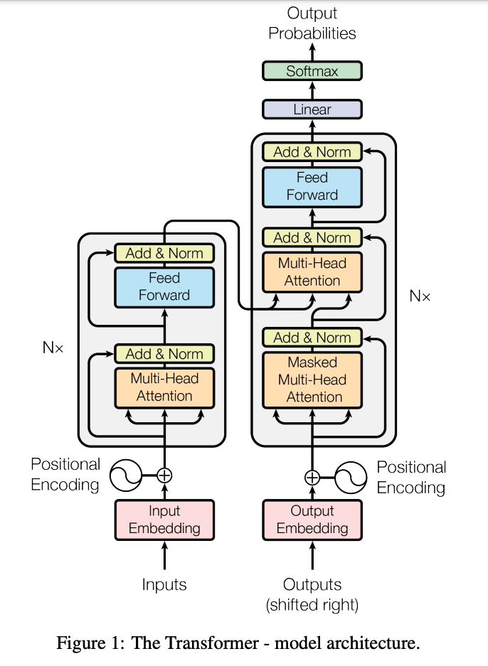

# NanoGPTExperiment
My attempt at building a generative pretrained transformer ML model, like Chat GPT.
My primary goal is to build the model piece by piece to gain further understanding of transformers, train it on a small data set of text and then try to generate meaningful output.
My secondary goal is to compare and contrast different generation functions.

## Setup
To run this model, you need to have a CUDA supporting GPU, otherwise the model will take a long time to run on a CPU.
The model takes in an input text file, the longer the better, and tries to generate text based off of the character sequences found in the text.

Windows:
```
py -m venv venv
venv\Scripts\activate.bat
py -m pip install --upgrade pip
py -m pip install -r requirements.txt
```

Linux/OSX:
```
python3 -m venv venv
venv/bin/activate
python3 -m pip install --upgrade pip
python3 -m pip install -r requirements.txt
```


I've supplied 2 texts to the model, one is the entire works of Shakespeare (1,115,394 characters) and episodes IV to VI of Star Wars (159,478 characters).

## Findings
Some immediate observations of the results - the model does not make grammatical sense. It can predict and generate new characters given the previous characters of a sentence, but it does not understand the words in a contextual sense. This is because the model does not have word or sentence embeddings. If it had word/sentence embeddings, we might be able to get more grammatically correct lines.

It's interesting to compare the output of both the Shakespeare text and the Star Wars text.
The Shakespeare text is more unique and random than the Star Wars text, but is less coherent.
When I was training on the Star Wars  text, I found that the model got a significantly lower training loss but the validation loss started to climb up as it neared 5000 steps. I think this is because it started to overfit the text data, as the script is too too small. Despite this there are more lines in the generated Star Wars text that make sense, like "*LEIA: Are you all right?  Come on.*". However, I feel this is because these kinds of phrases would appear multiple times throughout the script.
There is potentially much to do here with word/sentence embeddings, which would allow the model to generate more coherent sentences - though I want to start over with a new model to do this.

<br>

## Results

### Shakespeare

AUFIDIUS:
So warrant, Sir, uncle;
Do here one gentle fet her father proceed
Faith strike and the cale in all her man!
A children, and like me soundly convey'd worship;
But who should pity your royaling gentleman?
He liest me w friends ne're not of you are nor greet of
ot, you fire. In us nothing truth to be done.

MENENIUS:
The besteed, he'll ever she died me better with her.

PERDIVERSO:
To she.

Second Servingman:
So here, but puts you with witding, flower 'tis told:
The fathere shall provoke her beggarle,
But see apolume you to rusing in herself.

JOHN OF GAUNT:
That they shall enrich with King Herence's darth,
Or oft orath! Look and they that thou wantor bends,
Thou so left'st thou hast to loath, pale to mark our:
Whast any mind, booth will he soot it beloved,
To fe my forfe; and I have done,--

LADY ANNE:
So standing what?

ROMEO:
Should it.

KING LEWIS XI:
Hold, hark: shall come the kneft duke off;
He weight make daughter courself and part indeed:
But she would strift
Intercale mercy, if the will cannot shall sit

Put ever: there is that third in the tales of men
Amagia wall hence, on the his body of men,
To prepared in him.

GREGORY:
Speak madly great in this desperate corse;
Indeed from that he list to stay, so live,
Let that yet no excuse, go my mind. Have I
An imper thy Forbalty weath to him honour.

KING HENRY OVI:
Go, be make far, many lord.

### Star Wars
LEIA: You like back it!

LANDO: Backing them? Whey don't -- wrong, we come here?

LEIA: All right? I'm quite powerfr to compass.

HAN: Command you too late vacuate.

HAN: Not really!

LUKE: Dack!

HAN: You havo one board scons.

LEIA: You would use, going?

THREEPIO: Do you take this true point! The ability to this shat!  Some kid!

THREEPIO: Look!  I told you to forget it.  Turn to outrange, which will you be.

HAN: Then they hear st. I lose to your deaction!

LUKE: I told my gone in in the fire quire.

LUKE: I'll be just going crazy with you, the Jabba the Hutt.

LI'm trying compled!

HAN: Chewie! G--one-three!

HAN: Get out there!

LEIA: Are you all right?  Come on.

LUKE: I'll be at two!

HAN: Get of her!

LUKE: Now!  Come on!

LEIA: I you gotta good with about you.  Oucce make stop!  Where could plensure?

LUKE: You, but this fightere wars aways!

LUKE: Look I'm a way another you could. Thear-- you get? Oh, did up! Oh! So go!

THREEPIO: Sir, that of your shipful! Jabba at madme well palt!

HAN: Chewie, get up on the security-tworders and not aventher energy season.  We'll move on the leader shield and cannon will give confire those planetration block AA--ythreport ling.  The Rebel cruise well speed from a great pilot of being strange.

LUKE: It looks like I'm going nowhere.

HAN: I'm all right, patrol. Now for a droids will if I get bocEdeult. Right speed, signal.

LEIA: Cut the ship no leave!

HAN: Ult me to it!

LUKE: Jabba.  He's that only a fighter place chance.  You have been jettisoned.

VADER: Did you fire droids?

LANDO: No, we've going aboard. I just want you to live been patience.

YODA: Hman change. No disince time.

HAN: I could about somebody get this big so bucket I could.

LUKE: Thank you. To younders.

THREEPIO: I once you \Nice!  Come on!

HAN: I told you to turn one.

HAN: Don't to really to picked out by hom interfere.

LUKE: What about the might helpere?  You know it!

LUKE: Quietly, see where might back.

THREEPIO: Jabba offers the but of your sight, sir.  I interructed and in a

<br>

# How I developed this model



The model was based on the Attention Is All You Need paper (https://arxiv.org/abs/1706.03762), and Andrej Karparthy's amazing tutorials on youtube: https://www.youtube.com/@AndrejKarpathy
